# 60 MINUTE SOHO

60 Minute Soho is a tour company operating in Soho, London. The company offers a selection of walking tours in the area, each tour exploring a different theme. 

The company requires a website that has a minimalistic aesthetic that displays professionalism and siplicity.

The objectives of this site are to gain the users trust and to encourage them to sign up for a tour.

# UX

## Goals

### Visitor Goals

The target audience for 60 Minute Soho includes:

- Tourists visiting Soho/London.
- People looking for daytime activities.
- People interested in art, culture and history.
- People from all countries and people who speak different languages.

The user goals include:

- To find a walking tour of Soho.
- To gauge whether the operator is trustworthy.
- To easily sign up for a walking tour.
- To discover more about the company and the walking tours they conduct.
- To easily find information on specific needs such as accessibility.

The design achieves these needs by:

- Having a large hero image directly associated with the Soho area displayed on the landing page.
- Having a single-page design that displays a clear narrative whilst scrolling.
- Having a single-page design and simple navigation system that allows the user to sign up in as fewer clicks as possible.
- Having a minimalist design-style which allows information to be displayed clearly.
- Highlighting a prominent and fixed navigation bar that assists the clear compartmentation of the web page making the user navigate the page with ease.
- Displaying relevant images and descriptive information assigned to each of the tours advertised to provide the user with an idea of what to expect.
- Providing social media icons/links within the footer to allow the user to discover more about the business and to nurture the relationship.
- Having an 'accessibility' section on the page allowing the user to discover more specifities about the tours.
- Having a smart and professional responsive webpage to mirror the professionalism that company wants to convey.

### Business Goals

The business goals include:

- To encourage the user to book onto a walking tour.
- To promote a professional and trusted brand image that evokes trust to differentiate from competitors.
- To give confidence to international tourists and encourage visiters who require accessibility to book onto the tours.
- To make information clear and consice to improve the quality of information and reduce the amount of confusion surrounding language/accessibility.
- To gather interest and connect via social media.

### User Stories

1. As a user who is living in London and looking for an activity, I expect to easily find the web page, and quickly discover what types of walking tours the business offers.

2. As a user who is visiting for a weekend , I expect to easily discover how long the tours last for.

3. As a user who is visiting for a few days, I want to be able to quickly book onto a tour as fast as possible.

4. As an international tourist, I expect to easily discover if the tour guides are multilingual. 

5. As a user who has accessibility requirements, I want to easily learn if the routes are accessible for wheelchair use.

6. As a user who has just been on a walking tour with this company and had a good experience, I want to easily find links to their social media to see updates.

7. As a user with reading difficulties, I expect the website to be compatible with a screen reader.

## Visual Design

### Wireframes

Wireframes were drawn on [balsamic](https://balsamiq.com) to draw a general layout of the web page.

Click here to view wireframes: https://drive.google.com/drive/folders/1sStum-9PVeh2ybLao4RfvSAAKJ0clWOX?usp=sharing

### Fonts

Fonts were imported into the code from [Google Fonts](https://fonts.google.com/).

- The main logo uses the font 'Fredoka'. This font was chosen for the logo after some research into font stylings that draw inspiration from the 1960s - an era heavily associated with Soho and Carnaby Street.
- The logo is a big, round and friendly font that is also bold and simple in design. This choice of font means the the logo always stands out, crearing contrast against the simplistic styling of the secondary font.
- It seemed appropriate to use this font as it can immiediately be associated with the history of the area which in turn is immediately relevant due to the historical themes explored within the walking tours.
- The secondary font is 'Roboto', a sens-serif font. The font is simple and creates a frictionless reading experiene. The simplicity of the font creased a nice contrast to the 'Fredoka' logo font and ensures all information on the web page is clear and easy to read. A mixture of bold, italic and light variants of the 'Roboto' font have been used to create contrast between headers and paragraphs.

### Icons

- The above icons from the 'Fontawesome' Icon library have been utilised as classes in the i tag.
- The icons have been styled cohesively with the overarching color palette.
- Icons present within the accesssibility section of the web page are displayed in a blue (#2E2999) color as this color is believed to encourage a perception of trust.
- Social media icons have been positioned within the web page footer. By utilising the 'a' tag these icons have associated hyperlinks. Now the user can identify the speicifc social media platform based on their iconic logo and access the hyperlink immediately with one click. 

### Colors

With the user and business goals in mind, it was important for this site to have a minimalist color pallete. The color palette needs to appear professional, complement the content to make it clear and easy-to-read whilst also ensuring that the page has character.

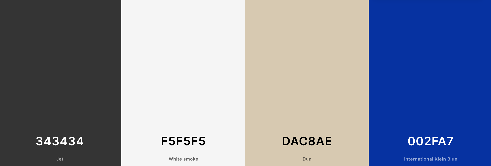

- 'Dun' #DCD0B6 - This gentle color is used the provide character and to distinguish between sections of the web page, mirroring the building walls on the hero image ensures the page feels familiar for the full length of the web page. The color along-side the hero image is intended to evoke imagery of an urban area such as Soho.
- 'Whitesmoke' #F5F5F5 - A comfortbale off-white. This color provides a perfect canvas for bold easy-to-read text on large sections of the website whilst also providing more character than a stark bright white.
- 'Jet #323232 - A dusty shade of black. This color has been used to add an element of sophistication to the font color on the website. Thus variation of black suggests age and mystery, reflecting the nature of the walking tours. This color is chosen for our font-styles to stand out on a pale background.
- 'International Klein Blue' #2E2999 - A deep blue which is sure to stand out against a pale background color. The blue has been used for icons and some text to emphasise trust and responsibility, designed to make the user feel at ease about using the service.

### Images

A full-quality hero image (displayed below) is utilised at the top of the page so the user immediatley understands that the service provided operates in Soho. The hero image is taken on a day with blue skies to appear friendly and welcoming to the user which helps to influence user engagement.

The three images (displayed below) utilised within the tours section were chosen due to their association with each of the themed walks. This is to provide the user with a small glimpse into the kinds of things they will encounter on that specific tour.

All images chosen are of a high quality so that they appear clear and crisp.

All images have the necessary stylings so that they adjust seamlessly to ensure they remain at an adequate level of prominance on all screen-sizes.

### FEATURES

#### Page Elements

##### Hero Image

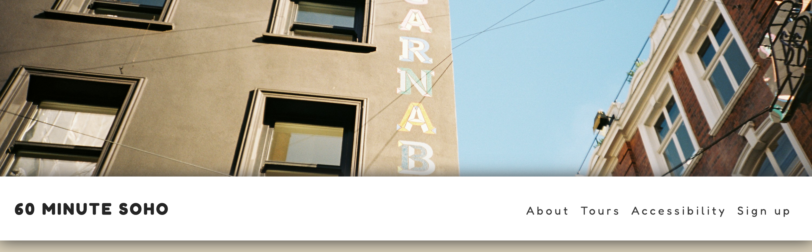

A large hero image spans the full width of the page and is the first image the user sees upon entering the site. The large image is designed to immediatley grab the users attention as they land on the site. 

The hero image uses responsive stlying to ensure all screen sizes can faciltiate the image and keep the page elements visually proportionate to the design.

##### Nav Bar

The navigation bar contains a promient logo and is responsive so that on larger screens it displays all the page navigation links in a row and on smaller screens the navigation links are contained within a drop down. 

The menu options on the nav bar have animated CSS styling so that they appear blue when you hover over the text, drawing attention to the options as you select.

The position of the navigation bar is sticky so that when users scroll down the page they are easily able to access the navigation menu, landing them on their desired section of the site. The sticky header allows the user to access the menu items quickly, saving time and providing a more efficient user experience.

A box shadow has been added to the navigation bar to provide the user with a sense of 

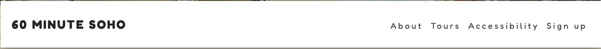

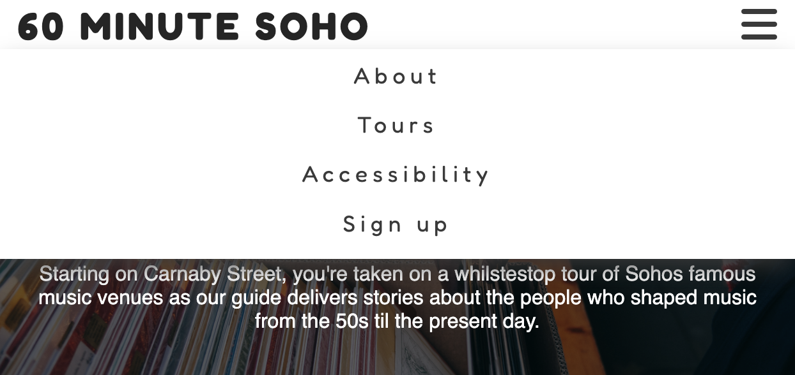

#### Info Bar

The info bar is located immediately below the navigation bar. The info bar is immediatley visible as the user lands on the web page.

The icons and text on this section provide clear and impactful information which immedialtely informs the user what services are provided. 

The icons are easily recongisable to all users, are visually appealing and improve the user experience.

The infobar has been constructed within a grid where the icons and their associated text appear in two columns on smaller screens, with a media query instated so that the information appears on one singular line on larger screens so that the website remains proportionate and doesnt utilises excess space.

Humans tend to read from left to right, an icon of a walking person with text saying 'walking tours' directly beneath this has been positioned on the left of the info bar. This is so that users immediately distinguish what service the business is offering leaving less room for ambiguity created by the somewhat ambiguous brand name. 

** ADD PHONE PHOTO OF INFO BAR IMAGE

#### Tours Info Section

The tours section includes information regarding the three tours that are currently available to the user.

Three sections of informative text have been presented on top of three separate images, all displayed in on top of one another. Each image is related to its respective text.

Images have been used here to communicate the purpose of each tour and to help the user distinguish between the tours, giving them a sense of variety.

Each of the three tours have been styled into a flexbox grid. The flex value allows for a media query to be utilised and to position the content side by side in three columns on larger screens.

The width of the images within the content are all fully resonsive to adjustments in screensize.

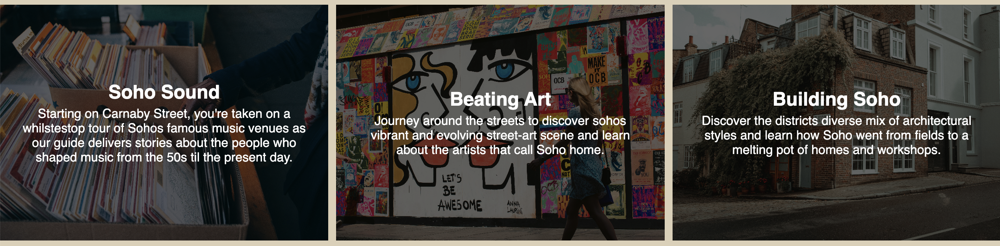

** ADD PHONE PHOTO OF TOURS IMAGE

#### Accessibility Info Section

The accessibility information section includes four divs within a flexbox grid. Each div contains clear information and icons to provide users wishing to learn more about the accessibility of the tours with more information. 

The flexbox grid allows the information to be responsive to changes in screen size and the columns also adjust formation in screen size due to a media query.

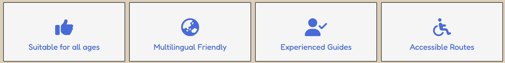

#### Sign Up Section

The sign up section is created using a form element. The form is designed to be simple and easy to use.

Positioning the form at the bottom of the site ensures the user flow is not interrupted to discourage abandoment. 

The simple design is purposeful to ensure that the process of completing the form appears easy and streamlined.

An option for the user to sign up for a newsletter has been added using radiobuttons at the bottom of the form to allow them to give permission for further information and promotional material to be sent to their email.

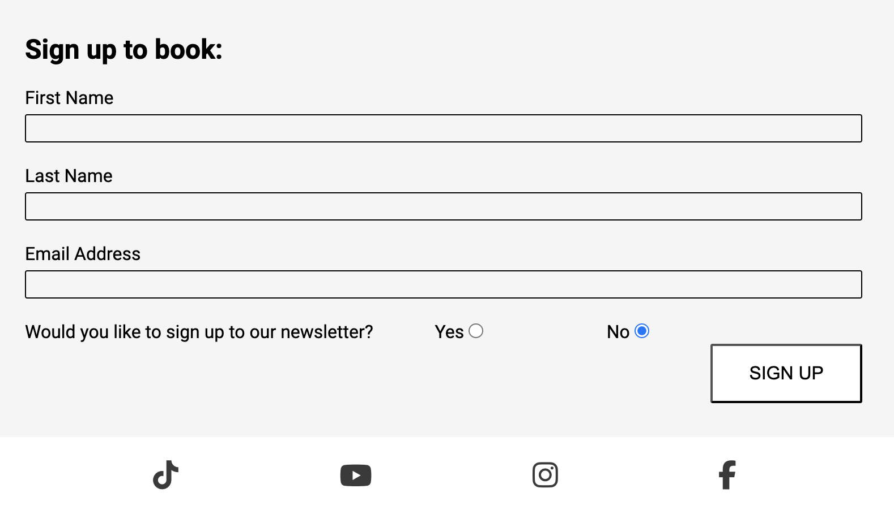

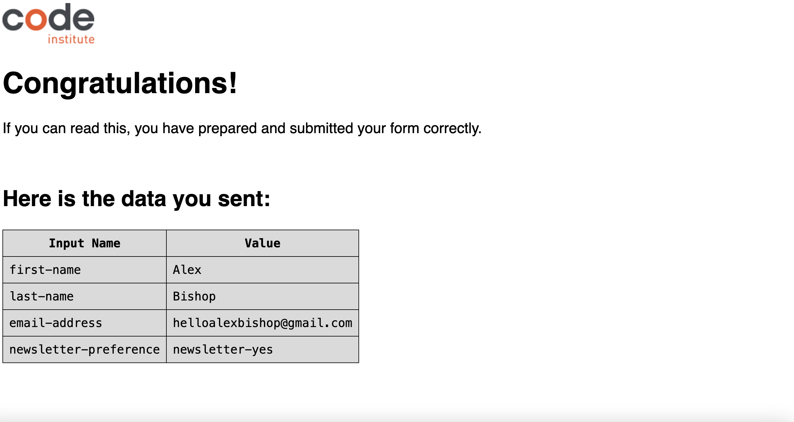

## Additional Features

###IMAGE LOADING BLUR
>>>EMAIL

## Feature Ideas

- A interactive gallery/slide section with photos of content and people taking part in the walking tours.
- Purchasing/cart options.
- An interactive section displaying text from review websites.
- A FAQ section to answer more of the users questions.
- More details regarding each walking tour.
- More options on the form to allow the user register and also log into the website if they have already registered.

## Technologies Used

### Languages
- Html - Used for page markup
- CSS - Used for styling

### Libraries
- Google Fonts - Used for font styles ('Fredoka' and 'Roboto').
- Font Awesome - Icons within info-bar, accessibility section and footer.

### Platforms
- Gitpod - IDE for project developemnt.
- Github - Used for storing code removely and for deployment.

### Other Tools Utilised
- Coolers - For color selection and color swatch.
- SMPRO - App utilised for framing web page screengrabs with iphone/ipad/macbook.
- Favicon - A generator used to create a favicon.

### TESTING

#### METHODS

* ATTENTION NEEDED BELOW (CONTENT IS TEMPLATE ONLY) *
##### Validation Process
- The HTML file has been validated with W3C HTML5 Validator, with no errors or warnings to show.
- CSS has been validated with W3C CSS Validator and auto-prefixed with CSS Autoprefixer.
- All links have been checked with W3C Link Checker

* ATTENTION NEEDED ABOVE (CONTENT IS TEMPLATE ONLY)*

##### GENERAL TESTING

- Each time a feature was added a preview port was opened to test the website to view the impact of the changes and to note any immediate bugs.
- Adaptations were made to the stylings on the google dev tools service whilst previewing the web page to manipulate and experiment with stylings outside of the gitpod IDE.
- The web bage was sent to friends and family for testing, with feedback being documented and acted upon.
- The form within the web page has been fully validated and will not send without the propper validation/all inputs containing the required information.
- The web page has been manually tested for screen reader compatibility using the Google Chrome screen reader extension with no aparent defects noted.
- All external links open in new tabs.

Below are the results from the CSS, html and accessibility checks.

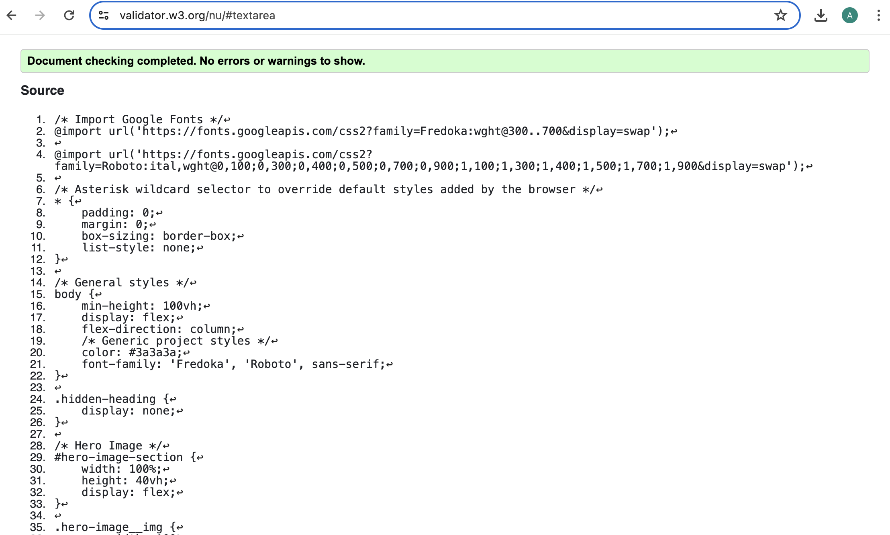

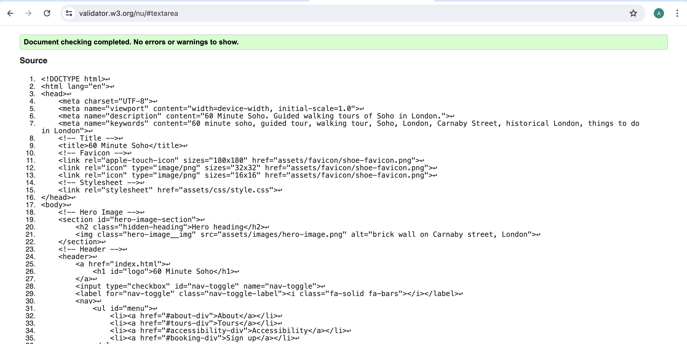

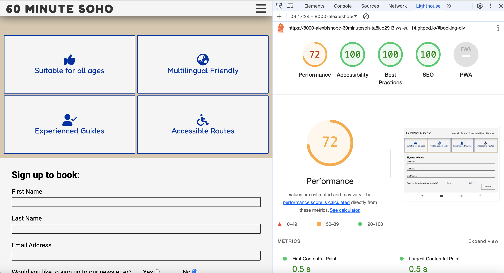

##### MOBILE TESTING
- The site was frequently tested on my own iphone with iOS as well as sent to friends/family with samsungs and older models of iphones to ask for feedback.
- Testing involved going through the entire sign up process, utilising the navigation bar, and checking all other functions.
- Chrome was utilised to inspect the site in mobile and tablet format, navigating the pages and testing the functions within Chromes 'development tools' service.

##### Desktop Testing
- The site has been developed within Chrome on a Macbook Pro.
- The site was sent to friends and family on numerous different generations of iphone and samsung, as well as different desktop devices.
- The site has been tested on multiple browsers including Safari.

#### BUGS

##### Existing Bugs
- The hero image does not fully cover the hero div on some specific screen sizes when tested.
- The navigation bar remains open after clicking the burger icon which blocks the users view of the content when you ustilise the navigation bar until it is manually closed.

##### Fixed Bugs
- The fixed (sticky) navigation bar at the top of the page was covering sections of text when utilised so the associated sections of the site you were expecting to navigate to appeared muddled and unclear. This was fixed by adding a hidden div above each section the same height of the nav bar and linking the nav bar to the hidden div in order for the user to see the full content of the section they wished to view.
- The booking form loaded an error message once details had been entered saying the page visited was not secure. This was due to a typo in the target="" where https:// was written as http://.
- Accessibility performance failed in testing due to a lack of contract between a previous blue utilised for font-color on the site. After changing blue to a darker blue the accessibility rating checked provided a successful score of 100.

##### DEPLOYMENT

This site has been deployed to GitHub pages via the following steps:
- Within the GitHub 60-Minute-Soho repository, the settings tab was opened.
- Within the settings tab, the 'pages' menu option in the left hand column was opened.
- Within 'pages', the settings for the branch were changed to ensure this was set to the 'main' branch. After this the 'Save' button was clicked.

The live link to the site can be accessed [here](https://alexbishopcode.github.io/60-Minute-Soho/)

https://alexbishopcode.github.io/60-Minute-Soho/

#### CREDITS AND CONTACT

##### Content

All text on the site was written by myself from scratch with research conducted on [Wikipedia](https://www.wikipedia.org) for the about and tours sections.

The Love Running Project on the [Code Institute](https://www.codeinstitute.net) Full Stack Web Development Course was used as a loose template to create some of the general framework of the site. 
Most notably the code from the Love Running project was utilised to create the foundation of the navigation bar, the sign up form and the social media links before developing and adapting these to be coherant with my web page design and required functions for this project.

The Sample Project README.md section of the Full Stack Web Development course on [Code Institute](https://www.codeinstitute.net) was used as a guide to understand the content required to be present within a README.md file.

The 'Horizon Photography'(https://github.com/Ri-Dearg/horizon-photo/blob/main/README.mdREADME) project owned by Ri-Dearg on github was used as a guide to create a general framework for this README.md file.

##### Contact

Please feel free to contact me on helloalexbishop@gmail.com

